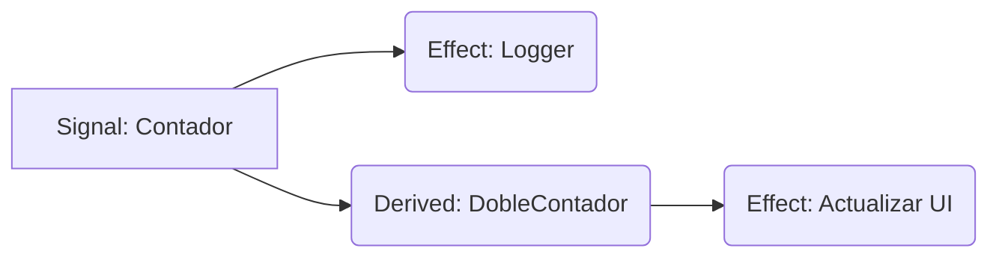

# Gestión de Estado (Neutron)

Nucleus introduce **Neutron**, un sistema de gestión de estado reactivo de última generación, diseñado para ser granular, seguro en hilos (thread-safe) e increíblemente simple de usar. Sigue el patrón "Signal" popularizado por frameworks modernos de frontend, pero adaptado para el modelo de propiedad de Rust y la arquitectura fullstack de Nucleus.

> [!NOTE]
> **Neutron vs Otros**: A diferencia de Redux o Context, que a menudo activan re-renderizados completos, Neutron solo actualiza las dependencias específicas que cambian. Esto es "Reactividad Granular".

---

## 1. Conceptos Principales

### El Gráfico de Señales

Imagina el estado de tu aplicación como un gráfico. Los datos fluyen desde las **Signals** (fuente de la verdad) hacia los **Effects** (observadores) o **Estado Derivado** (valores calculados).



Cuando `Contador` cambia, Neutron sabe automáticamente que `Logger` y `DobleContador` necesitan actualizarse.

### Seguridad en Hilos (Thread Safety)

La mayoría de las librerías reactivas son de un solo hilo (JS). Nucleus es **Multi-Hilo**.
- **Signals son `Send + Sync`**: Puedes pasarlas entre hilos.
- **Bloqueo Interno**: Usamos `Arc<RwLock<T>>` para garantizar acceso concurrente seguro.

---

## 2. Referencia de API

### `Signal<T>`
La unidad atómica de estado.

| Método | Descripción | Ejemplo |
|--------|-------------|---------|
| `new(val)` | Crea una nueva señal | `let s = Signal::new(0);` |
| `get()` | Lee valor y rastrea dependencia | `let val = s.get();` |
| `set(val)` | Sobrescribe valor y notifica | `s.set(10);` |
| `update(f)` | Modifica in-place y notifica | `s.update(\|v\| *v += 1);` |

### `create_effect`
Un efecto secundario que se ejecuta automáticamente.

**Ejemplo:**
```rust
create_effect(move || {
    println!("Cuenta actual: {}", count.get());
});
```

---

## 3. Mejores Prácticas: El Patrón Store

Para aplicaciones complejas, evita variables globales. Encapsula señales relacionadas en un **Store**.

### ✅ Haz Esto
```rust
pub struct CartStore {
    items: Signal<Vec<Item>>,
    total: Signal<f64>,
}
```

---

## 5. Preguntas Frecuentes

**P: ¿Es más rápido que React?**
R: Sí. React re-renderiza componentes. Neutron ejecuta closures específicos. No hay sobrecosto de Virtual DOM diffing.
